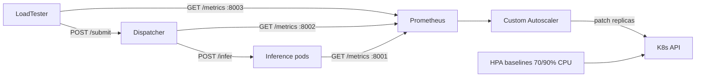

# Elastic ML Inference Serving

Kubernetes-based **elastic ML serving** project: ResNet18 image classification (CPU-only), centralized queue, Prometheus monitoring, load tester, and a custom autoscaler driven by latency and queue depth (15 s MAPE loop).

**Primary SLO:** server-side p99 latency **< 0.5 s**.

---

## Architecture



| Component | Port | Role |
|-----------|------|------|
| Inference (`model_server.py`) | 8001 | ResNet18, 1 request per pod at a time |
| Dispatcher (`src/dispatcher/app.py`) | 8002 | Bounded queue + synchronous forwarding |
| Load tester (`src/load_tester/run.py`) | 8003 (metrics) | Triangle load profile + CSV export |
| Autoscaler (`src/autoscaler/controller.py`) | — | MAPE loop every 15 s |
| Prometheus | 9090 | 15 s scrape interval |

---

## Quick start (local)

### 1. Environment

```bash
python -m venv venv
# Windows
venv\Scripts\activate
# Linux/macOS
source venv/bin/activate

pip install torch==2.3.0 torchvision==0.18.0 --index-url https://download.pytorch.org/whl/cpu
pip install -r requirements.txt
pip install pillow opencv-python
```

### 2. Run the stack (3 terminals)

**Terminal 1 — Inference:**
```bash
python model_server.py
```

**Terminal 2 — Dispatcher:**
```bash
# Windows
set INFERENCE_URL=http://127.0.0.1:8001
# Linux/macOS
export INFERENCE_URL=http://127.0.0.1:8001
python src/dispatcher/app.py
```

**Terminal 3 — Load tester:**
```bash
python src/load_tester/run.py --target http://127.0.0.1:8002 --duration 60 --base 2 --peak 10
```

### 3. Check metrics

```bash
curl http://127.0.0.1:8001/metrics | findstr inference_duration
curl http://127.0.0.1:8002/metrics | findstr dispatcher_queue
curl http://127.0.0.1:8003/metrics | findstr loadtester_request
```

### 4. Single-request smoke test

```bash
python client.py
```

---

## Kubernetes deployment

```bash
kubectl apply -f k8s/namespace.yaml
kubectl apply -f k8s/inference-deployment.yaml
kubectl apply -f k8s/dispatcher-deployment.yaml
kubectl apply -f k8s/prometheus/
kubectl apply -f k8s/autoscaler-deployment.yaml
kubectl apply -f k8s/loadtester-job.yaml   # one-shot benchmark
```

See [docs/DEPLOYMENT.md](docs/DEPLOYMENT.md) for details (Docker images, Minikube, autoscaler dry-run).

---

## Repository structure

```
cloud-computing/
├── model_server.py              # ResNet18 inference service
├── client.py                    # Local smoke-test client
├── requirements.txt             # Python deps (excluding torch)
├── docker/
│   └── Dockerfile.loadtester
├── k8s/
│   ├── namespace.yaml
│   ├── inference-deployment.yaml
│   ├── dispatcher-deployment.yaml
│   ├── loadtester-job.yaml
│   ├── autoscaler-deployment.yaml
│   └── prometheus/
├── src/
│   ├── dispatcher/app.py        # Queue + workers + forwarding
│   ├── load_tester/
│   │   ├── run.py               # Load generator
│   │   └── images.py            # ImageNet samples as base64
│   └── autoscaler/              # MAPE controller + Queue+SLO policy
├── tests/
└── docs/
    ├── ARCHITECTURE.md
    ├── AUTOSCALER.md
    ├── DISPATCHER.md
    ├── LOAD_TESTER.md
    └── DEPLOYMENT.md
```

---

## Tests

```bash
python -m pytest tests/ -v
```

| File | Coverage |
|------|----------|
| `test_scaling_logic.py` | Queue+SLO policy |
| `test_prometheus_queries.py` | PromQL client |
| `test_k8s_patch.py` | K8s replica patch |
| `test_dispatcher_forward.py` | Dispatcher E2E forwarding |
| `test_load_tester.py` | RPS profile, payload, metrics |

---

## Documentation

| Document | Content |
|----------|---------|
| [docs/ARCHITECTURE.md](docs/ARCHITECTURE.md) | System overview, data flow, metrics |
| [docs/DISPATCHER.md](docs/DISPATCHER.md) | API, queue, workers, env vars |
| [docs/LOAD_TESTER.md](docs/LOAD_TESTER.md) | Triangle profile, CLI, Prometheus, K8s Job |
| [docs/AUTOSCALER.md](docs/AUTOSCALER.md) | Custom autoscaler (MAPE, policy, PromQL) |
| [docs/DEPLOYMENT.md](docs/DEPLOYMENT.md) | Minikube, manifests, checklist |
| [practical_HandsOn (1).md](practical%20HandsOn%20(1).md) | Initial inference-only tutorial |

---

## Implementation status

| Component | Status |
|-----------|--------|
| Inference + `/metrics` | Implemented |
| Dispatcher synchronous forwarding | Implemented |
| Load tester (merged from `load-tester` branch) | Implemented |
| Prometheus scrape (inference, dispatcher, loadtester) | Implemented |
| Autoscaler MAPE + Queue+SLO policy | Implemented (dry-run default in K8s) |
| HPA 70% / 90% baselines | Planned (`k8s/hpa-*.yaml`) |
| `workload.txt` bursty trace | Phase 2 — triangle profile in place |
| Benchmark plots / harness | Planned |

---

## Git branches

| Branch | Content |
|--------|---------|
| `main` | Project base |
| `infra-setup` | Initial K8s manifests |
| `elastic-autoscaler` | Autoscaler + dispatcher + integrated load tester |
| `load-tester` | Sakshi's script (merged into `elastic-autoscaler`) |
