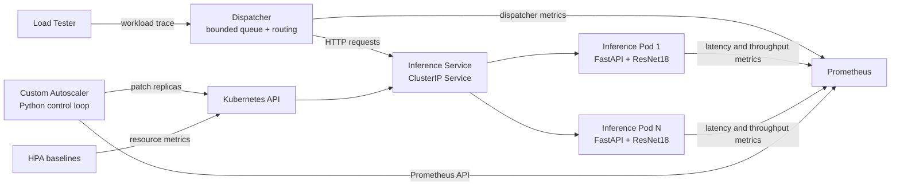
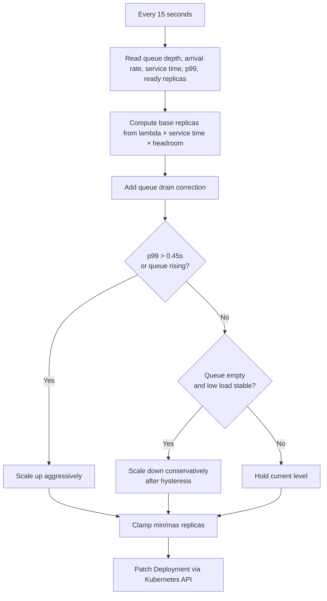
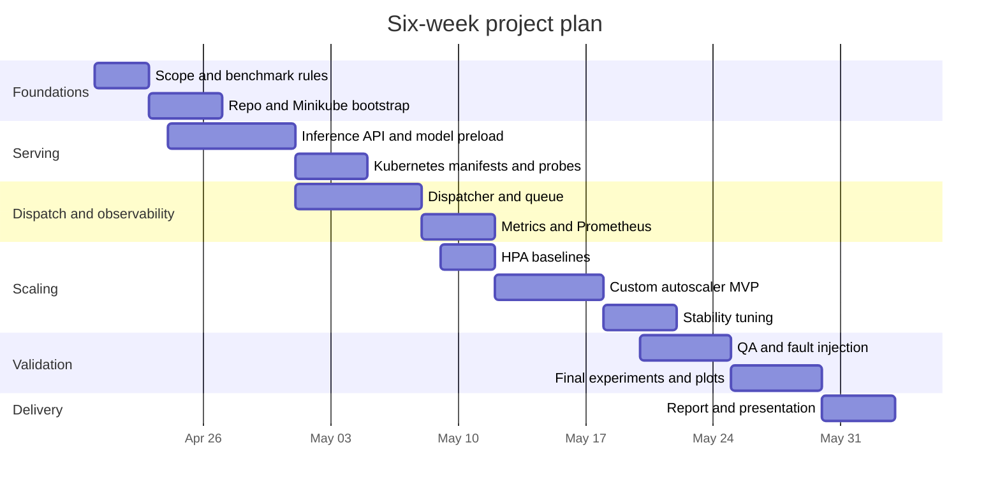

# Complete Action Plan for the Elastic ML Inference Serving Project

## Executive Summary

This report assumes the target project is the uploaded **Elastic ML Inference Serving** assignment brief: a group project to build an autoscaled, CPU-only ResNet18 image-classification service on Kubernetes, with a load tester, dispatcher, monitoring, and autoscaler; a server-side latency target below 0.5 seconds; and a final comparison of one custom autoscaler run against two Kubernetes HPA baselines at 70% and 90% CPU targets, all on laptops using Minikube. fileciteturn2file0

The strongest project-fit implementation is a **lean custom stack**: declarative Kubernetes manifests, one FastAPI inference process per pod, a separate dispatcher as the **only** queue, Prometheus for metrics, Metrics Server for HPA compatibility, and a Python autoscaler that queries Prometheus over `/api/v1` and patches the Deployment replica count through the official Kubernetes Python client. This matches the brief’s topology, keeps observability under your control, and exposes the latency and backlog signals that HPA does not natively optimize for. fileciteturn2file0 citeturn5search0turn5search1turn1search22turn4search0turn4search1turn4search3

A queue-aware, SLO-aware autoscaler is the best bet for beating CPU-only HPA in this assignment because the brief explicitly places queueing at the dispatcher, while HPA scales on observed resource utilization rather than direct queue or latency signals. In bursty traces, queue depth and latency trend are leading indicators of pending p99 violations; CPU averages usually lag. fileciteturn2file0 citeturn0search1turn4search2

A realistic delivery plan is **six weeks part-time** for a three-person team, or roughly **34–46 person-days** total. The minimum defensible submission is not a fancy serving framework; it is a reproducible end-to-end system with good instrumentation, fair HPA baselines, a stable custom autoscaler, and credible plots for p99 latency and CPU/core usage over the full experiment window. fileciteturn2file0 citeturn1search21turn1search1turn1search2

## Project Baseline and Assumptions

The uploaded brief specifies the project’s core technical goal, but several execution details remain unspecified or inconsistent. Most notably, the slide deck is dated **15-Apr-26** while the timeline slide still shows **June/July 2025**, so the schedule below should be treated as a relative plan until the real deadline is confirmed. fileciteturn2file0

| Attribute | Status | Working assumption for planning | Consequence if wrong |
|---|---|---|---|
| Project identity | Assumed from uploaded brief | This plan targets the uploaded Elastic ML Inference Serving assignment | If this is the wrong project, re-scope immediately |
| Scope | Partly specified | Build load tester, dispatcher, inference service, monitoring, autoscaler, and benchmarking harness | Extra features should be deferred |
| Domain | Specified | Cloud computing + ML inference serving on Kubernetes | Favors systems engineering over product polish |
| Budget | **Unspecified** | No paid cloud budget; use existing laptop only | Optimize for low CPU/RAM overhead |
| Timeline | **Unspecified / inconsistent** | Use a relative six-week plan | Hard deadline risk if the real date is earlier |
| Team size | Partly specified | “In groups” is specified; assume 3 people for planning | Role split must be adjusted for 2 or 4 people |
| Target platform | Partly specified | Minikube on laptop, declarative Kubernetes YAML, CPU-only inference | Avoid GPU assumptions and heavy control planes |
| Workload trace | Partly specified | A bursty input QPS trace will be supplied later | Tune for burst response and queue control |
| Regulatory constraints | **Unspecified** | Public/sample images only, no personal data retained, basic secure coding applied | If real user data appears, privacy/security scope expands |
| SLO interpretation | Partly specified | Treat `< 0.5s` as the core latency target and p99 as the principal benchmark statistic | If another percentile is required, dashboards must change |
| Definition of “outperform HPA” | **Unspecified** | Lower p99 at equal/lower core-seconds, or lower core-seconds at same/better p99 | Prevents subjective claims in the final report |

This assumption set aligns with the conceptual chart in the brief that contrasts **under-provisioning causing latency SLO violations** against **over-provisioning wasting compute**. For this assignment, success should be judged on both latency and CPU efficiency, not latency alone. fileciteturn2file0

## Recommended Architecture and Technology Decision

The brief’s system-design slides define the right control-loop shape: **load tester → dispatcher → inference replicas**, with **monitoring feeding a separate autoscaler** that talks to the Kubernetes API. Preserve that architecture. It keeps queueing explicit, backpressure measurable, and scaling logic testable. Use declarative YAML, a Deployment for inference replicas, and a Service for stable networking. fileciteturn2file0 citeturn5search0turn5search1



This architecture closely follows the system-design diagram in the uploaded brief, especially the separation between dispatcher, monitoring, autoscaler, and the Kubernetes API. fileciteturn2file0

I recommend intentionally simple inference pods: **one FastAPI worker process per pod**, model loaded at startup, `/readyz`, `/healthz`, and `/metrics` endpoints, fixed CPU request/limit at one core as required by the brief, and **no internal request queue**. That preserves the assignment’s rule that queueing happens only at the dispatcher, and it avoids the Prometheus Python client’s multiprocess complications unless you deliberately choose to handle them. After the baseline is stable, you can optionally test the CPU-only quantized ResNet18 variant as an optimization. fileciteturn2file0 citeturn8search19turn5search5turn10search0turn10search13turn6search20turn2search12

The dispatcher should be a **bounded, observable queue**, not a thin proxy. In this project it is the only legitimate place to absorb bursts, expose backlog, apply backpressure, and optionally drop requests when the system is overloaded. A simple bounded in-memory queue is enough for the course project; adding a durable message broker would increase complexity without improving the grading-critical comparison against HPA. fileciteturn2file0

Prometheus is the right metrics backbone because it is named in the brief, supports histogram-based latency analysis, and offers a stable HTTP API for a custom controller. Use histograms for latency, gauges for queue depth and in-flight work, counters for arrivals/completions/drops, and `histogram_quantile()` to compute p99. Metrics Server should also be enabled so the HPA baselines use the standard Kubernetes resource-metrics path and `kubectl top` remains available for debugging. fileciteturn2file0 citeturn1search0turn1search1turn1search2turn1search22turn4search3

The custom autoscaler should be **queue-aware and SLO-aware**, not CPU-only. A practical control law for this topology is:

`target = clamp(min,max, ceil(lambda * S * headroom + queue_depth * S / drain_target))`

where `lambda` is recent arrival rate in requests/second, `S` is recent mean service time per request in seconds, `headroom` is usually 1.15–1.30, and `drain_target` is the number of seconds in which you want to clear backlog, such as 10 seconds. Add a fast-path scale-up when p99 exceeds 0.45s or the queue rises for two consecutive intervals. Scale down only when queue depth is zero, p99 is clearly below target, and low-load conditions persist for 60–90 seconds. This should outperform HPA because the brief’s bottleneck is queue-induced latency at the dispatcher, while HPA reacts to resource utilization rather than direct latency/backlog signals. fileciteturn2file0 citeturn0search1turn4search2turn1search1turn1search2



Compared with alternatives, the lean custom stack is the best fit for a laptop-based course project. FastAPI’s official docs emphasize high-performance APIs, straightforward testing, and container deployment; TorchServe now carries an official **limited-maintenance** warning; and KServe is powerful, but it adds broader serving-platform abstractions and control-plane complexity that are expensive on Minikube. Because the brief expects laptops rather than paid cloud accounts, the table below uses **local resource footprint** and **implementation overhead** instead of monthly cloud pricing. fileciteturn2file0 citeturn8search3turn8search12turn8search0turn2search3turn3search0turn3search2

| Approach | What it looks like | Major strengths | Major weaknesses | Estimated local footprint | Overall fit |
|---|---|---|---|---|---|
| **FastAPI + PyTorch + Prometheus + Python autoscaler** | Custom inference API, custom dispatcher, custom autoscaler | Smallest moving parts, easiest custom metrics, best control over queue semantics, closest to brief | More code to write than managed model-serving tools | **Low**: roughly 2–4 vCPU and 4–8 GB RAM for a workable dev setup | **Best choice** |
| **TorchServe + dispatcher + Python autoscaler** | PyTorch-specific model server behind dispatcher | Purpose-built for PyTorch serving | Official limited-maintenance warning; extra abstraction not needed for this assignment | **Low–medium**: roughly 3–5 vCPU and 4–8 GB RAM | Acceptable fallback |
| **KServe Standard mode + custom model server** | Kubernetes-native model serving platform with additional serving abstractions | Stronger long-term serving platform, built-in serving concepts | Heavier control plane, more CRDs and configuration, weak laptop fit; Standard mode HPA path is broader than the course needs | **High**: roughly 4–8 vCPU and 8–16 GB RAM | Good learning extension, poor shortest path |

## Implementation Plan and Timeline

The delivery sequence below is designed to de-risk the real unknowns in the right order: first request correctness, then observability, then HPA baselines, then custom scaling, then benchmark fairness. Effort ranges are planning estimates in **person-days**.

| Milestone | Task | Deliverable | Primary role | Effort |
|---|---|---|---|---|
| Foundation | Freeze assumptions, success metrics, benchmark rules | One-page scope note, acceptance rubric, benchmark definition | All | 1–2 |
| Foundation | Bootstrap repo, Makefile, Minikube profile, namespaces | Reproducible dev environment | Platform lead | 1–2 |
| Serving path | Build inference API with preloaded ResNet18 | `/predict`, `/readyz`, `/healthz`, `/metrics` | Serving lead | 3–4 |
| Serving path | Containerize and deploy inference service | Dockerfile, Deployment, Service, probes, resource settings | Serving + platform | 2–3 |
| Dispatch | Implement bounded dispatcher queue and routing | Dispatcher API, queue logic, backpressure or drop policy | Backend lead | 4–6 |
| Observability | Instrument metrics and deploy Prometheus | Histograms, gauges, counters, scrape config, core PromQL queries | Platform + autoscaling lead | 3–4 |
| Baseline | Deploy HPA 70 and HPA 90 configurations | Baseline manifests and run scripts | Platform lead | 1–2 |
| Autoscaling | Implement custom autoscaler MVP | Control loop, Prometheus polling, Kubernetes patching | Autoscaling lead | 4–6 |
| Autoscaling | Add safety rails and stabilization | Hysteresis, cooldown, min/max caps, fallback behavior | Autoscaling lead | 2–3 |
| Validation | Add automated workload replay and artifact capture | Benchmark harness, logs, metrics export | Autoscaling + backend | 3–4 |
| Validation | Run QA and fault-injection cases | Kill-pod, slow-start, missing-metrics scenarios | All | 3–4 |
| Tuning | Optimize p99 and CPU/core efficiency | Final thresholds, queue policy, optional quantized trial | All | 4–5 |
| Delivery | Produce final figures, README, and demo/report | Submission-ready project package | All | 4–5 |

This ordering matters. Do **not** start with the custom autoscaler. First build a correct inference path and good metrics, then establish fair HPA baselines, then improve on them. That sequencing follows the brief’s component breakdown and its final requirement to compare your controller against HPA rather than to merely ship a working service. fileciteturn2file0

Because the uploaded deadline slide is inconsistent, the Gantt below assumes a six-week schedule starting from the current date.



For a three-person team, the cleanest split is: **platform/observability**, **serving/dispatcher**, and **autoscaling/experiments**, with all three sharing QA, documentation, and the final demo.

| Role focus | Typical responsibilities | Estimated share |
|---|---|---|
| Platform and observability | Minikube, manifests, Prometheus, HPA baselines, scripts | 30–35% |
| Serving and dispatcher | Inference API, queue, routing, request validation | 30–35% |
| Autoscaling and experiments | Control law, benchmark harness, plots, final comparison | 30–40% |

## Testing, Deployment, and Monitoring

Testing must cover both **software correctness** and **system behavior under load**. FastAPI officially supports pytest-based API testing, Kubernetes probes are the standard way to prevent traffic reaching unready containers, and Prometheus histograms are the correct foundation for percentile latency analysis. citeturn8search0turn8search5turn5search2turn5search5turn1search1turn1search2

| Test layer | What to test | Suggested tooling | Exit criterion |
|---|---|---|---|
| Unit | Preprocessing, label decoding, queue operations, autoscaler math | `pytest` | Core logic passes consistently |
| API contract | `/predict`, `/readyz`, `/healthz`, `/metrics` | FastAPI TestClient, `curl` | Stable status codes and schema |
| Integration | Dispatcher → Service → Pod → metrics | Minikube smoke tests | End-to-end request succeeds |
| Performance | Low, medium, bursty, and peak trace segments | Provided load tester or equivalent | Reproducible latency curves |
| Resilience | Pod kill, delayed startup, Prometheus timeout | `kubectl`, scripted fault injection | System degrades gracefully |
| Regression | Three benchmark runs under fixed settings | Benchmark harness | Raw data and plots are reproducible |

For deployment, keep the production path for the course as simple as possible: use an **internal ClusterIP Service** for pod-to-pod traffic, expose only the **dispatcher** for local manual testing, build and push images into the Minikube environment, and enable Metrics Server before creating HPA resources. Minikube’s service tooling is the easiest local-access path, and Metrics Server is the standard resource-metrics source for built-in autoscaling and `kubectl top`. citeturn9search2turn9search9turn4search3

A practical deployment runbook is:

1. Create a dedicated Minikube profile with fixed CPU and RAM.  
2. Enable Metrics Server and verify `kubectl top pods` works.  
3. Build images into the Minikube environment.  
4. Apply namespaces, ConfigMaps, Prometheus, inference Deployment/Service, then dispatcher.  
5. Confirm probes and `/metrics` endpoints before any load test.  
6. Apply either HPA 70, HPA 90, or the custom autoscaler, never multiple controllers against the same Deployment at once.  

At minimum, expose the metrics below. The brief’s final comparison is impossible without them. It is also worth initializing zero-valued series for metrics you know should exist, because missing time series make PromQL and dashboards brittle. fileciteturn2file0 citeturn6search10

| Metric | Type | Why it matters |
|---|---|---|
| `inference_request_duration_seconds` | Histogram | p50/p95/p99 latency and SLO checks |
| `inference_requests_total` | Counter | Throughput and status accounting |
| `inference_inflight_requests` | Gauge | Busy pods and concurrency signal |
| `dispatcher_queue_depth` | Gauge | Leading indicator for scale-up |
| `dispatcher_oldest_request_age_seconds` | Gauge | Detects starvation even when queue is small |
| `dispatcher_requests_enqueued_total` | Counter | Arrival rate |
| `dispatcher_requests_dropped_total` | Counter | Overload visibility |
| `autoscaler_desired_replicas` | Gauge | Decision traceability |
| `autoscaler_scale_actions_total` | Counter | Auditability of scale reasons |
| `kube_deployment_status_replicas_available` | Gauge | Actual available capacity |
| CPU usage and throttling metrics | Built-in / scraped | Compare HPA behavior against your controller |

Because each inference replica is specified with a **CPU request and limit of one core**, the simplest defensible “number of CPU cores” metric for the brief’s final plot is **allocated cores = replica count × 1 CPU**. Also record actual CPU usage so you do not confuse reserved capacity with consumed capacity. fileciteturn2file0 citeturn10search0turn10search1

Example PromQL for the final dashboard:

```promql
histogram_quantile(
  0.99,
  sum(rate(inference_request_duration_seconds_bucket[1m])) by (le)
)

sum(dispatcher_queue_depth)

sum(kube_deployment_status_replicas_available{deployment="inference"})

sum(rate(dispatcher_requests_dropped_total[1m]))
```

These queries rely on Prometheus histogram practice and the `histogram_quantile()` function, and raw results can be exported using the Prometheus HTTP API for plotting in Python or a notebook. citeturn1search1turn1search2turn1search22

For the final benchmark, keep **workload trace, initial replica count, resource requests/limits, pod image, and monitoring window constant** across all three runs: custom autoscaler once, HPA at 70%, and HPA at 90%. Save raw series, not just screenshots. That is the only way to regenerate plots and defend the result if the demo machine behaves differently on presentation day. fileciteturn2file0

## Risks and Optimization

The main technical risks are predictable from the official docs and the project brief: HPA optimizes observed resource utilization rather than direct latency signals; histogram quantiles are only as good as their buckets; Python Prometheus metrics need care in multiprocess deployments; and Kubernetes controllers modifying replica counts should use least-privilege access. citeturn0search1turn1search1turn6search20turn5search6turn5search13

| Risk or pitfall | Why it is dangerous here | Mitigation |
|---|---|---|
| Hidden queueing inside inference pods | Violates the project model and distorts p99 | One worker per pod; queue only in dispatcher |
| Huge dispatcher queue | Masks scaling errors and destroys tail latency | Keep queue bounded; surface drops explicitly |
| Cold-start model load | New pods may be added but not actually ready | Load model at startup; use startup and readiness probes |
| Bad latency buckets | p99 becomes noisy or misleading | Concentrate histogram buckets around the 0.5s SLO |
| Oscillating autoscaler | Constant scale up/down hurts both p99 and efficiency | Use hysteresis, smoothing, cooldown, and minimum hold time |
| Unfair benchmark comparison | Makes the final claim unconvincing | Hold workload/resources/initial conditions constant |
| Laptop saturation | Results become host-limited, not controller-limited | Cap max replicas; monitor host pressure; reduce optional components |
| Prometheus outage or stale metrics | Controller may make unsafe decisions | Fail safe: hold current replicas or revert to conservative floor |
| Multiprocess metrics mistakes | Duplicated or broken metrics in Python workers | Prefer single-process pods unless multiprocess mode is configured correctly |
| Confusing reserved vs used CPU | Weakens the “number of CPU cores” plot | Plot both allocated cores and actual CPU usage |

The highest-value optimizations are the boring ones. For **performance**, preload the model, use startup/readiness probes, keep one worker per pod, and only then test quantized ResNet18. For **cost**, tune scale-down hysteresis and compare **core-seconds**, not just peak replica count. For **security**, give the autoscaler a dedicated service account with minimal permissions and avoid exposing internals publicly. For **maintainability**, pin versions, keep manifests declarative, and separate configuration from code. citeturn5search5turn2search12turn5search3turn5search6turn8search16

| Optimization area | Highest-value action | Secondary action | Expected payoff |
|---|---|---|---|
| Performance | Preload model and gate readiness until warm | Optional quantized ResNet18 trial | Better cold-start behavior and lower CPU latency |
| Cost / efficiency | Conservative scale-down with hysteresis | Cap replicas by measured laptop capacity | Lower core-seconds without p99 collapse |
| Security | Least-privilege RBAC for autoscaler | Validate image size/type and request limits | Safer controller and cleaner failure modes |
| Maintainability | Declarative YAML + pinned dependencies | Structured logs and metrics naming conventions | Easier debugging and reproducibility |
| Evaluation quality | Export raw metrics for all runs | Regenerate plots from scripts, not manually | Credible, repeatable final comparison |

## Artifacts and Acceptance Criteria

The brief’s mandatory output is broader than code. You need a reproducible system, a fair benchmark, and figures that show the full run. The checklist below is the minimum artifact set I would require before calling the project submission-ready. fileciteturn2file0

| Required artifact | Acceptance criterion |
|---|---|
| README and runbook | A clean clone can be run from documented commands without guesswork |
| Dockerfiles and pinned dependencies | Images build reproducibly and run on CPU only |
| Kubernetes manifests | Declarative YAML for namespaces, Deployments, Services, probes, Prometheus, HPA, and custom autoscaler |
| Inference service code | Returns valid labels for sample images; model preloaded; health and metrics endpoints present |
| Dispatcher code | Bounded queue, explicit routing, queue-depth metrics, and documented overload behavior |
| Monitoring setup | Prometheus scrapes all components; p99, queue depth, drops, replicas, and CPU metrics are queryable |
| HPA baseline configs | Two runnable baselines: 70% CPU and 90% CPU |
| Custom autoscaler | Scaling loop is logged, metricized, and reproducible |
| Benchmark harness | Same workload trace can be replayed identically across runs |
| Raw experiment exports | Time-series data saved for all three runs, not just screenshots |
| Final comparison plots | Full-run plots for p99 latency and CPU/core usage across custom, HPA70, HPA90 |
| SLO evidence | Final tuned run demonstrates whether `< 0.5s` was achieved and where it failed if not |
| Outcome statement | “Outperform HPA” is defined explicitly and evaluated against the saved data |
| Presentation/report package | Architecture, decisions, risks, plots, and limitations are documented clearly |

If you have to cut scope, cut fancy dashboarding or alternative-framework experimentation first. Do **not** cut dispatcher metrics, reproducible HPA baselines, or raw experiment export, because those are the pieces that make a custom autoscaler credible instead of anecdotal. This report prioritized the uploaded brief and official English-language documentation for Kubernetes, Minikube, Prometheus, FastAPI, PyTorch, KServe, TorchServe, and the official Kubernetes Python client. fileciteturn2file0 citeturn0search0turn0search1turn9search13turn1search0turn8search3turn2search1turn3search0turn2search3turn4search0turn4search1