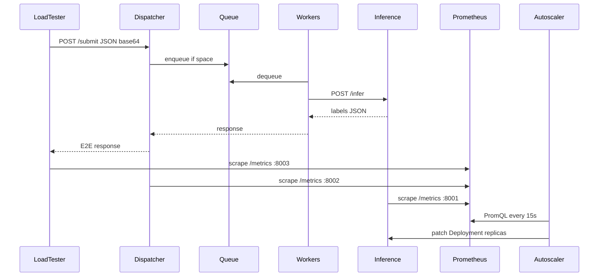

# System architecture

This document describes the **implemented** architecture of the *Elastic ML Inference Serving* project: request flow, metrics, and scaling loop.

---

## 1. Overview

The system follows the brief's model:

**Load tester → Dispatcher (queue) → Inference (N replicas) ← Autoscaler ← Prometheus**



---

## 2. Unified API contract

All services use the same image payload format:

```json
{"data": "<base64 JPEG>"}
```

| Service | Endpoint | Method | Response |
|---------|----------|--------|----------|
| Inference | `/infer` | POST | `["label1", ...]` (top-5 ImageNet) |
| Dispatcher | `/submit` | POST | Synchronous proxy to inference |
| Load tester | — | — | Client of `/submit` |

**Shared utility endpoints:**

| Endpoint | Role |
|----------|------|
| `GET /healthz` | Liveness |
| `GET /readyz` | Readiness (inference only) |
| `GET /metrics` | Prometheus text exposition |

---

## 3. Components

### 3.1 Inference (`model_server.py`)

- **ResNet18** model preloaded at startup.
- `torch.set_num_threads(1)` — aligned with 1 CPU core/pod quota.
- **Sequential** processing: one inference at a time per pod (no internal pool).
- Metrics: `inference_requests_total`, `inference_duration_seconds`.

### 3.2 Dispatcher (`src/dispatcher/app.py`)

- **Bounded queue** (`asyncio.Queue`, configurable size).
- **Async workers** (`DISPATCHER_WORKER_COUNT`, default 4): each worker handles one request at a time.
- **Synchronous forwarding**: the `/submit` handler waits for the inference response before replying to the client → measurable E2E latency.
- **503** when the queue is full.
- Implicit load balancing via the K8s `inference` Service (kube-proxy round-robin).

See [DISPATCHER.md](DISPATCHER.md).

### 3.3 Load tester (`src/load_tester/`)

- Origin: `load-tester` branch (Sakshi's script), refactored for the `/submit` API.
- **Triangle** load profile: RPS rises from `base` to `peak` then falls over `duration` seconds.
- Images: ImageNet samples downloaded and base64-encoded.
- **CSV** export (`timestamp, status, latency_seconds`) + Prometheus metrics.
- `/metrics` server on port **8003** while running.

See [LOAD_TESTER.md](LOAD_TESTER.md).

### 3.4 Autoscaler (`src/autoscaler/`)

- **MAPE** loop every **15 s**.
- Reads Prometheus: `dispatcher_queue_depth`, p99 `inference_duration_seconds`, `rate(dispatcher_requests_total[1m])`.
- **Queue + SLO** policy (`QueueSloPolicy`): fast scale-up after 2 pressure cycles, scale-down with cooldown.
- Patches `Deployment/inference` via the Kubernetes client (dedicated RBAC).
- `--dry-run` mode: log decisions without patching (K8s manifest default).

See [AUTOSCALER.md](AUTOSCALER.md).

### 3.5 Prometheus

- Scrape interval **15 s** (aligned with autoscaler / HPA).
- Jobs in `k8s/prometheus/configmap.yaml`:
  - `inference` :8001
  - `dispatcher` :8002
  - `loadtester` :8003

---

## 4. Key metrics

### Dispatcher (scaling signals)

| Metric | Type | Autoscaler use |
|--------|------|----------------|
| `dispatcher_queue_depth` | Gauge | Backlog, scale-up |
| `dispatcher_requests_total` | Counter | Arrival rate λ |
| `dispatcher_requests_in_flight` | Gauge | In-flight load |
| `dispatcher_requests_completed_total` | Counter | Throughput |
| `dispatcher_requests_dropped_total` | Counter | Overload (503) |

### Inference (server SLO)

| Metric | Type | Use |
|--------|------|-----|
| `inference_duration_seconds` | Histogram | p99 vs 0.5 s SLO |
| `inference_requests_total` | Counter | Volume |

### Load tester (client SLO / reports)

| Metric | Type | Use |
|--------|------|-----|
| `loadtester_request_duration_seconds` | Histogram | p99 including queue wait |
| `loadtester_requests_total{status}` | Counter | Success/error rate |

**Reference PromQL:**

```promql
# Server p99 latency
histogram_quantile(0.99, sum(rate(inference_duration_seconds_bucket[1m])) by (le))

# Client p99 latency
histogram_quantile(0.99, sum(rate(loadtester_request_duration_seconds_bucket[1m])) by (le))

# Arrival rate
rate(dispatcher_requests_total[1m])
```

---

## 5. Design principles

| Principle | Rationale |
|-----------|-----------|
| Single queue at dispatcher | Only observable backlog point; matches the brief |
| No queue inside inference pods | Otherwise `queue_depth` no longer reflects real congestion |
| 15 s decision interval | Fair comparison with HPA |
| ±1 replica per cycle | Anti-thrashing |
| Scale-down hysteresis | 4 stable cycles before reduction (configurable) |

---

## 6. HPA vs custom autoscaler

| | HPA (CPU 70/90%) | Custom autoscaler |
|--|------------------|-------------------|
| Signal | Average CPU utilization | Queue + p99 latency |
| Burst response | Delayed (CPU rises after queue builds) | Leading indicator via `queue_depth` |
| Formula | `ceil(replicas × CPU / target)` | Little's Law + SLO guardrail |
| Interval | ~15 s | 15 s (configurable) |

---

## 7. Source files

| Path | Responsibility |
|------|----------------|
| `model_server.py` | ResNet18 inference |
| `src/dispatcher/app.py` | Queue, workers, forward |
| `src/load_tester/run.py` | Load generation + metrics |
| `src/load_tester/images.py` | Base64 samples |
| `src/autoscaler/controller.py` | MAPE loop |
| `src/autoscaler/policies/queue_slo_policy.py` | Scaling decisions |
| `src/autoscaler/prometheus_client.py` | PromQL queries |
| `src/autoscaler/k8s_client.py` | Deployment patch |
