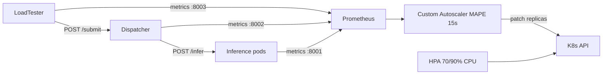

# Custom Autoscaler — Implementation Documentation

Autonomous controller that adjusts inference replica count **every 15 seconds** based on **p99 latency** and **queue depth** — not CPU alone.

**Primary SLO:** server-side p99 latency **< 0.5 s**.

**Baseline:** Kubernetes HPA with CPU targets of **70%** and **90%**.

---

## 1. System overview

### 1.1 Topology



### 1.2 Design principles

| Principle | Rationale |
|-----------|-----------|
| **Single queue (dispatcher)** | Brief requires **one request at a time** per replica; congestion must be observable at the dispatcher. |
| **No internal queue in pods** | Otherwise `queue_depth` no longer reflects true backlog. |
| **15 s decision interval** | Aligns with HPA cadence; fair comparison. |
| **Max ±1 replica per cycle** | Limits thrashing. |
| **Slow scale-down (hysteresis)** | 4 stable cycles before reducing (configurable). |

### 1.3 Hardware assumptions

- **Minikube** (or kind) on a laptop, **CPU only**.
- Each inference pod: `resources.requests/limits.cpu: "1"`, `memory: 1Gi`.
- `torch.set_num_threads(1)` in `model_server.py`.

---

## 2. Repository structure (current)

```
cloud-computing/
├── model_server.py
├── client.py
├── requirements.txt
├── docker/Dockerfile.loadtester
├── k8s/
│   ├── namespace.yaml
│   ├── inference-deployment.yaml
│   ├── dispatcher-deployment.yaml
│   ├── loadtester-job.yaml
│   ├── autoscaler-deployment.yaml
│   └── prometheus/
├── src/
│   ├── dispatcher/app.py          # Implemented: queue + sync forward
│   ├── load_tester/
│   │   ├── run.py                 # Implemented: triangle profile
│   │   └── images.py
│   └── autoscaler/
│       ├── controller.py          # MAPE loop
│       ├── prometheus_client.py
│       ├── k8s_client.py
│       └── policies/queue_slo_policy.py
├── tests/
└── docs/
```

---

## 3. Components (implemented)

### 3.1 Inference service

**File:** `model_server.py`

| Endpoint | Role |
|----------|------|
| `POST /infer` | JSON `{"data": base64}` → top-5 labels |
| `GET /healthz` | Liveness |
| `GET /readyz` | Readiness (model loaded) |
| `GET /metrics` | `inference_requests_total`, `inference_duration_seconds` |

Sequential inference only — no parallel worker pool inside the pod.

### 3.2 Dispatcher

**File:** `src/dispatcher/app.py` — see [DISPATCHER.md](DISPATCHER.md).

- `POST /submit` — synchronous E2E proxy to inference.
- Bounded queue, async workers, 503 when full.
- Metrics: `dispatcher_queue_depth`, `dispatcher_requests_total`, etc.

### 3.3 Load tester

**Files:** `src/load_tester/` — see [LOAD_TESTER.md](LOAD_TESTER.md).

- Triangle RPS profile (`--base`, `--peak`, `--duration`).
- Targets dispatcher `/submit` with base64 JPEG payloads.
- CSV + Prometheus: `loadtester_request_duration_seconds`, `loadtester_requests_total`.

Merged from branch `load-tester` (original `sakshi-load_tester.py` removed).

### 3.4 Prometheus

**Config:** `k8s/prometheus/configmap.yaml`

- Scrape interval: **15 s**.
- Jobs: `inference`, `dispatcher`, `loadtester`.

---

## 4. MAPE loop

**File:** `src/autoscaler/controller.py`

```python
INTERVAL_SEC = 15
DEPLOYMENT = "inference"
NAMESPACE = "inference-system"
REPLICA_MIN = 1
REPLICA_MAX = 10
MAX_DELTA_PER_CYCLE = 1
```

| Phase | Action |
|-------|--------|
| **Monitor** | PromQL: queue depth, p99 latency, arrival rate |
| **Analyze** | Compare p99 to SLO, detect queue pressure |
| **Plan** | `QueueSloPolicy.decide()` → desired replicas |
| **Execute** | PATCH Deployment scale (unless `--dry-run`) |

### 4.1 Queue + SLO policy

**File:** `src/autoscaler/policies/queue_slo_policy.py`

| Parameter | Default | Role |
|-----------|---------|------|
| `SLO` | 0.5 s | Target latency |
| `S_warn` | 0.45 s | Alert threshold |
| `S_safe` | 0.35 s | Scale-down threshold |
| `queue_threshold` (α) | 3.0 | Queue pressure threshold |
| `headroom` | 1.2 | Capacity margin |
| `drain_target` | 10 s | Target backlog drain time |
| `cooldown_cycles` | 4 | Stable cycles before scale-down |

**Capacity formula (Little's Law):**

```
N_base  = ceil(λ × S̄ × headroom)
N_queue = ceil(queue_depth × S̄ / drain_target)
N_raw   = clamp(min, max, max(N_base, N_queue))
```

**Decision rules:**

1. **Fast scale-up** if `p99 > S_warn` or `queue > α` for **2 consecutive cycles** → `N + 1`.
2. **Capacity scale-up** if `N_raw > N_current` → `N + 1` (max delta).
3. **Scale-down** if queue = 0, p99 < safe, `N_raw < N_current`, for `cooldown_cycles` → `N - 1`.
4. **Hold** otherwise.

**Why better than HPA?** HPA uses `ceil(currentReplicas × CPU / targetCPU)` and does not see queue or latency. During bursts, the queue grows before average CPU exceeds 70%.

### 4.2 Kubernetes execution

**File:** `src/autoscaler/k8s_client.py`

Dedicated ServiceAccount with Role scoped to `deployments/scale` patch/get only.

**Dry-run:**
```bash
cd src && python -m autoscaler.controller --dry-run
```

---

## 5. Reference PromQL queries

```promql
# Queue depth
dispatcher_queue_depth

# Server p99 latency (1m window)
histogram_quantile(
  0.99,
  sum(rate(inference_duration_seconds_bucket[1m])) by (le)
)

# Client p99 latency (load tester)
histogram_quantile(
  0.99,
  sum(rate(loadtester_request_duration_seconds_bucket[1m])) by (le)
)

# Arrival rate
rate(dispatcher_requests_total[1m])
```

Configurable via env: `PROM_QUERY_QUEUE_DEPTH`, `PROM_QUERY_P99_LATENCY`, `PROM_QUERY_ARRIVAL_RATE`.

---

## 6. Comparison with HPA

### 6.1 Experimental protocol

| Rule | Detail |
|------|--------|
| Same load profile | Same load tester `--base`, `--peak`, `--duration` |
| Same duration | e.g. 30–45 min with spikes |
| Warm-up | 2–3 min before recording |
| One active autoscaler | Disable HPA during custom run (and vice versa) |
| Same min/max replicas | e.g. 1–10 |

### 6.2 Expected analysis

- % time p99 < 0.5 s.
- Total **core-seconds** (cost efficiency).
- HPA lag during load increases (queue rises before CPU).
- HPA over-provisioning at 70% vs under-performance at 90%.

---

## 7. Tests

```bash
python -m pytest tests/ -v
```

| Test file | Coverage |
|-----------|----------|
| `test_scaling_logic.py` | Queue+SLO policy decisions |
| `test_prometheus_queries.py` | PromQL client mock |
| `test_k8s_patch.py` | Deployment scale patch |
| `test_dispatcher_forward.py` | Dispatcher forwarding |
| `test_load_tester.py` | RPS profile, payload, metrics |

---

## 8. Environment variables (controller)

| Variable | Default | Description |
|----------|---------|-------------|
| `PROMETHEUS_URL` | `http://prometheus:9090` | Prometheus URL |
| `DEPLOYMENT_NAME` | `inference` | Target Deployment |
| `DEPLOYMENT_NAMESPACE` | `default` | Namespace (`inference-system` in K8s) |
| `INTERVAL_SEC` | `15` | MAPE interval |
| `REPLICA_MIN` / `REPLICA_MAX` | `1` / `10` | Replica bounds |
| `MAX_DELTA_PER_CYCLE` | `1` | Max change per cycle |
| `SERVICE_TIME_SECONDS` | `0.2` | Estimated S̄ |
| `S_WARN` / `S_SAFE` | `0.45` / `0.35` | Latency thresholds |
| `QUEUE_THRESHOLD` | `3.0` | Queue threshold α |
| `HEADROOM` | `1.2` | Capacity headroom |
| `DRAIN_TARGET_SECONDS` | `10.0` | Backlog drain target |
| `COOLDOWN_CYCLES` | `4` | Cycles before scale-down |

---

## 9. Deployment checklist

- [ ] Minikube running, metrics-server OK
- [ ] Docker images built and loaded
- [ ] Prometheus scrapes all targets (`/targets` UI)
- [ ] Inference responds via dispatcher (`POST /submit`)
- [ ] Load tester exports `loadtester_request_duration_seconds`
- [ ] Autoscaler dry-run: consistent logs for 5 min
- [ ] Custom run + export metrics
- [ ] HPA-70 run + export (disable custom autoscaler)
- [ ] HPA-90 run + export
- [ ] Generate p99 + replica graphs for report

---

## 10. Known limits and roadmap

| Item | Status |
|------|--------|
| Triangle load profile | Implemented |
| `workload.txt` trace | Implemented (`--workload` replay) |
| HPA 70/90 manifests | Implemented (`k8s/hpa-70.yaml`, `k8s/hpa-90.yaml`) |
| Benchmark CSV/plot scripts | Implemented (`experiments/`) |
| PID / predictive policy | Optional extension |

| Limit | Mitigation |
|-------|------------|
| Cold start (model load) | Readiness probe, `minReadySeconds` |
| Short PromQL `rate()` windows | Window ≥ 1m, longer warm-up |
| Shared Minikube CPU | Repeat runs; use median of 3 trials |

---

## References

- [ARCHITECTURE.md](ARCHITECTURE.md) — full system view
- [DISPATCHER.md](DISPATCHER.md) — queue and forwarding
- [LOAD_TESTER.md](LOAD_TESTER.md) — load generation
- [DEPLOYMENT.md](DEPLOYMENT.md) — K8s deployment
- [Kubernetes HPA](https://kubernetes.io/docs/tasks/run-application/horizontal-pod-autoscale/)
- [Prometheus histogram_quantile](https://prometheus.io/docs/prometheus/latest/querying/functions/#histogram_quantile)
