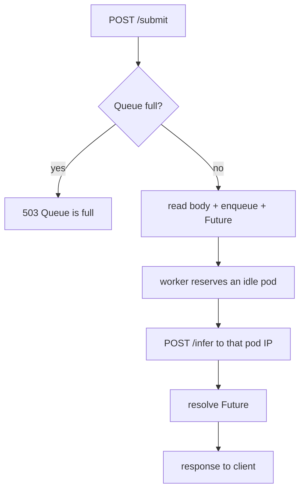

# Dispatcher — Queue and per-pod dispatch

The dispatcher is the **only queueing point** in the system. It receives requests
from the load tester, holds them in a short bounded queue, and forwards each one to
an inference pod — **one in-flight request per pod**.

**Source:** [`src/dispatcher/app.py`](../src/dispatcher/app.py)

> 📄 The authoritative, current design and results are in
> [`experiments/results/REPORT.md`](../experiments/results/REPORT.md). This file is
> the component reference.

---

## Role

1. Expose `POST /submit` to the load tester.
2. Maintain a **short bounded** FIFO queue (size 3); when full, shed with **503**.
3. Forward each request to a specific ready inference pod, keeping **at most one
   in-flight request per pod**.
4. Return the inference response to the client (**server-side** latency).
5. Expose Prometheus metrics, including the graded SLO histogram.

---

## Per-pod dispatch (why not the ClusterIP Service)

The dispatcher does **not** send to the `inference` ClusterIP Service. kube-proxy's
L4 load-balancing is per-connection and random, so it piles several concurrent
requests onto the same pod, which then serialises them on its single inference
thread — violating the spec's *"replicas do not queue, one inference at a time"*
(slide 21) and inflating tail latency.

Instead the dispatcher resolves the **headless** Service
(`inference-headless`) to the set of ready pod IPs and addresses pods **directly**:

- A `ReplicaPool` tracks the ready pod IPs and an `idle` set.
- A pool of worker coroutines (`DISPATCHER_WORKER_COUNT`, 20 in the manifest) each
  reserve **one idle pod**, take one queued request, forward it to that pod, and
  return the pod to the idle set only when it answers.
- Effective concurrency therefore equals the number of **ready replicas**
  (≤ `REPLICA_MAX`), with exactly one request in flight per pod.
- The raw request body (~130 KB base64 image) is forwarded **verbatim** — the
  dispatcher does not JSON-parse/re-serialise it; the inference pods parse it.

---

## Request flow

---

## API

### `POST /submit`

Request body: `{"data": "<base64-encoded JPEG>"}` (forwarded verbatim to `/infer`).

| Code | Body | Cause |
|------|------|-------|
| 200 | `["label1", ...]` | Successful inference |
| 502 | `{"error": "..."}` | Forwarding error / pod went away |
| 503 | `{"error": "Queue is full"}` | Backpressure (shed) |

### `GET /metrics`, `GET /healthz`

Prometheus text metrics; liveness.

---

## Environment variables

| Variable | Manifest value | Description |
|----------|----------------|-------------|
| `DISPATCHER_QUEUE_MAX_SIZE` | `3` | Max queued requests; shed (503) beyond. Bounds the worst-case wait. |
| `DISPATCHER_WORKER_COUNT` | `20` | Worker coroutine pool (≥ `REPLICA_MAX`); effective concurrency is capped by the ready replica count. |
| `INFERENCE_HEADLESS` | `inference-headless.inference-system.svc.cluster.local` | Headless Service DNS resolving to ready pod IPs. |
| `INFERENCE_POD_PORT` | `8001` | Inference pod port. |
| `DISPATCHER_FORWARD_TIMEOUT_SEC` | `2` | Per-forward timeout (frees a worker from a wedged pod). |

---

## Prometheus metrics

| Metric | Type | Description |
|--------|------|-------------|
| `dispatcher_request_duration_seconds` | Histogram | **Graded SLO**: server-side latency (queue wait + inference). |
| `dispatcher_queue_depth` | Gauge | Requests waiting in the queue (autoscaler signal). |
| `dispatcher_requests_in_flight` | Gauge | Requests being forwarded. |
| `dispatcher_requests_total` | Counter | Total received (arrival rate). |
| `dispatcher_requests_completed_total` | Counter | Successful forwards (HTTP 200). |
| `dispatcher_requests_dropped_total` | Counter | Shed requests (queue full) — availability. |

---

## Kubernetes deployment

Manifest: [`k8s/dispatcher-deployment.yaml`](../k8s/dispatcher-deployment.yaml).
Requires the **headless** Service `inference-headless` (defined in
`k8s/inference-deployment.yaml`) for per-pod DNS resolution. Port 8002; Prometheus
scrapes `/metrics`.
