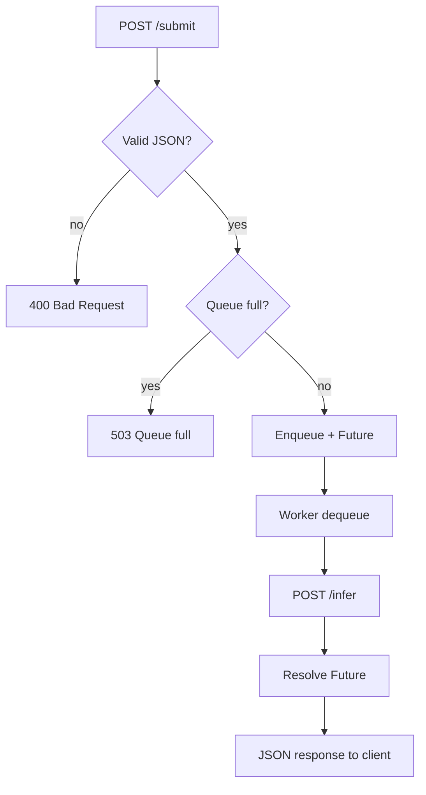

# Dispatcher — Queue and forwarding

The dispatcher is the **only queueing point** in the system. It receives requests from the load tester, enqueues them when needed, and forwards them to inference pods synchronously.

**Source:** [`src/dispatcher/app.py`](../src/dispatcher/app.py)

---

## Role

1. Expose `POST /submit` to the load tester.
2. Maintain a **bounded** FIFO queue.
3. **Forward** each request to `INFERENCE_URL/infer`.
4. Return the inference response to the client (**end-to-end** latency).
5. Expose Prometheus metrics for the autoscaler.

---

## Request flow



1. The handler increments `dispatcher_requests_total`.
2. If the queue has capacity, the request is wrapped in a `QueuedRequest` (data + `asyncio.Future`).
3. A **worker** (among `DISPATCHER_WORKER_COUNT`) consumes the queue.
4. The worker calls inference, resolves the Future, decrements `in_flight`.
5. The `/submit` handler (awaiting the Future) returns the inference body and HTTP status.

---

## API

### `POST /submit`

**Request:**
```http
POST /submit HTTP/1.1
Content-Type: application/json

{"data": "<base64-encoded JPEG>"}
```

**Responses:**

| Code | Body | Cause |
|------|------|-------|
| 200 | `["label1", "label2", ...]` | Successful inference |
| 400 | `{"error": "..."}` | Invalid JSON or missing `data` |
| 502 | `{"error": "..."}` | Network error to inference |
| 503 | `{"error": "Queue is full"}` | Backpressure |

### `GET /metrics`

Prometheus text metrics.

### `GET /healthz`

```json
{"status": "ok"}
```

---

## Environment variables

| Variable | Default | Description |
|----------|---------|-------------|
| `DISPATCHER_QUEUE_MAX_SIZE` | `100` | Maximum queue size |
| `INFERENCE_URL` | `http://inference.inference-system.svc.cluster.local:8001` | Inference service base URL |
| `DISPATCHER_WORKER_COUNT` | `4` | Number of parallel workers |

**Local:**
```bash
# Windows
set INFERENCE_URL=http://127.0.0.1:8001
set DISPATCHER_WORKER_COUNT=2
# Linux/macOS
export INFERENCE_URL=http://127.0.0.1:8001
export DISPATCHER_WORKER_COUNT=2

python src/dispatcher/app.py
```

---

## Prometheus metrics

| Metric | Type | Description |
|--------|------|-------------|
| `dispatcher_queue_depth` | Gauge | Requests waiting in queue |
| `dispatcher_requests_in_flight` | Gauge | Requests being forwarded |
| `dispatcher_requests_total` | Counter | Total requests received |
| `dispatcher_requests_completed_total` | Counter | Successful forwards (HTTP 200) |
| `dispatcher_requests_dropped_total` | Counter | Rejected requests (queue full) |

---

## Kubernetes deployment

Manifest: [`k8s/dispatcher-deployment.yaml`](../k8s/dispatcher-deployment.yaml)

- Namespace: `inference-system`
- Port: **8002**
- Prometheus annotations: scrape `/metrics` on 8002
- Probes: `GET /healthz`

---

## Tests

```bash
python -m pytest tests/test_dispatcher_forward.py -v
```

Covers: mocked forwarding, 503 on full queue, payload validation.

---

## Known limits

- **Explicit per-pod round-robin** is not implemented: the K8s `inference` Service distributes requests across replicas.
- Each worker sends at most **one** request at a time; with N workers and M replicas, up to `min(N, M)` parallel requests may hit inference (valid when M ≥ N and inference handles 1 req/pod).
