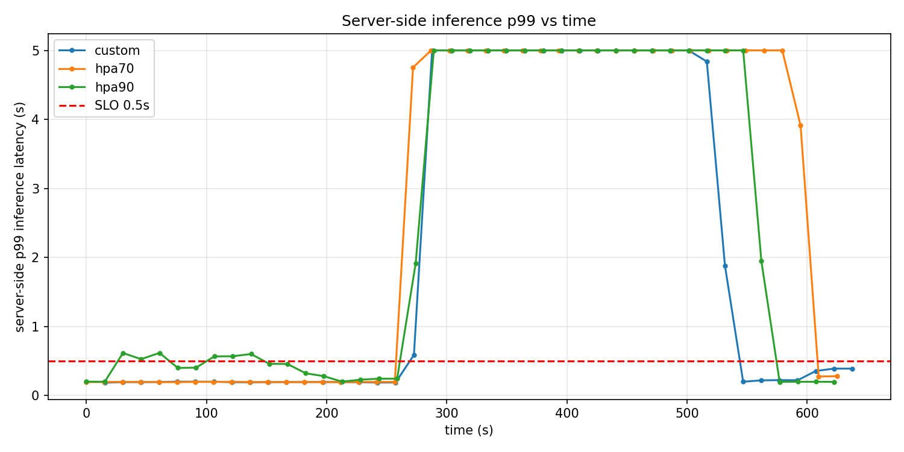
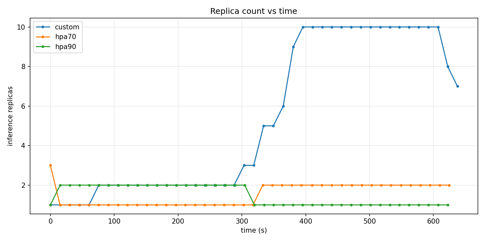
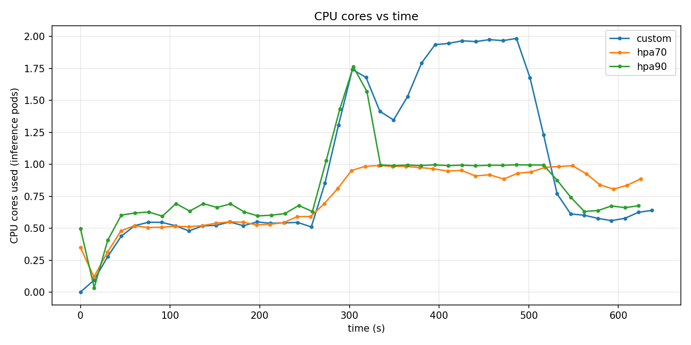
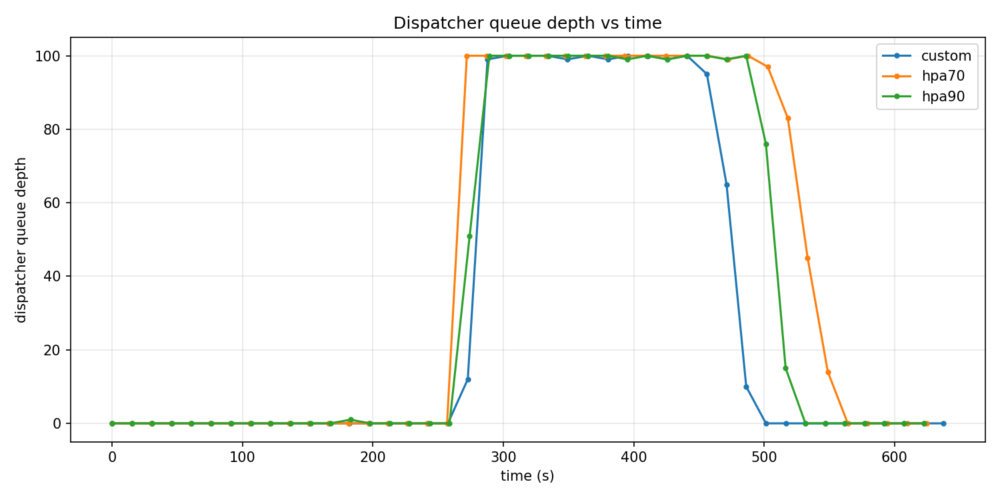

# Elastic ML Inference Serving — Autoscaling Results

Comparison of a **custom queue/SLO-driven autoscaler** against the **Kubernetes
Horizontal Pod Autoscaler (HPA)** at 70 % and 90 % CPU targets, for a ResNet18
image-classification inference service on Minikube.

> Data in this folder comes from one clean campaign (3 back-to-back runs replaying
> the same `workload.txt` trace). CSVs: `custom.csv`, `hpa70.csv`, `hpa90.csv`.
> Figures: `comparison_p99.png`, `comparison_cpu.png`, `comparison_replicas.png`,
> `comparison_queue.png`.

---

## 1. Setup

| Component | Role |
|-----------|------|
| Load tester | Replays `workload.txt` (per-second RPS trace, ~630 s): baseline ~7 rps, a burst peaking ~35–44 rps, then back to baseline. Sends real ImageNet images. |
| Dispatcher | Single centralized bounded queue (max 100). Forwards to the inference Service; returns `503` when the queue is full (load shedding). |
| Inference replicas | aiohttp + ResNet18 on **CPU**, `cpu request = limit = 1`, one inference at a time per replica. |
| Monitoring | Prometheus, per-pod scraping. |
| Autoscaler under test | (a) **custom** controller, or (b) **HPA 70 %**, or (c) **HPA 90 %** — only one active per run. |

**Graded metric — server-side service latency.** The p99 reported here is
`dispatcher_request_duration_seconds` = **queue wait + inference time**, i.e. the
latency a query actually experiences in the service. Steady-state inference time
alone is ~0.19 s, so a single replica serves ≈ **5.2 rps**.

**Custom autoscaler policy.** Every 15 s it reads queue depth, p99 and arrival
rate from Prometheus and picks a replica count from a queueing model
(`desired ≈ ceil(arrival_rate · service_time · headroom)`), with fast scale-up when
`p99 > 0.40 s` or `queue > 3`, capped at `MAX_DELTA_PER_CYCLE = 3` per cycle,
`min/max = 1/10`, and a 4-cycle cooldown before scaling down.

---

## 2. Methodology

Three runs, identical conditions, only the scaler differs:

1. **custom** — custom autoscaler, real scaling.
2. **hpa70** — Kubernetes HPA, `averageUtilization: 70`.
3. **hpa90** — Kubernetes HPA, `averageUtilization: 90`.

Each run resets inference to 1 replica, lets it settle, then replays the full
`workload.txt`. Metrics are sampled every 15 s from Prometheus
(`experiments/collect.py`); figures overlay the three runs
(`experiments/plot.py`). Reproduce with `pwsh ./scripts/run_all.ps1`.

---

## 3. Summary

| Metric | **custom** | HPA 70 % | HPA 90 % |
|---|---|---|---|
| Steady-state p99 | **0.19 s** ✅ | 0.19 s ✅ | ~0.20 s (early spikes 0.55–0.61 s) |
| Max replicas during burst | **10** | 2 | 2 (then drops to 1) |
| Peak CPU cores used | ~1.98 | ~0.99 | ~0.99 |
| Recovery — first p99 < 0.5 s after burst onset | **~274 s** | ~338 s | ~303 s |
| Scale-down after the burst | **yes (10 → 8 → 7)** | no (stuck at 2) | no (stuck at 1) |

**Headline:** the custom autoscaler is the only one that scales the service to
match demand (up to 10 replicas), recovers to the SLO **fastest** (shortest
violation window), and is the only one that scales back **down** afterwards. HPA,
keyed on CPU utilization, barely reacts (1–2 replicas) and stays in SLO violation
much longer.

---

## 4. Figures

### Server-side p99 latency vs time


All three sit at ~0.19 s at baseline. During the burst all three saturate (see
§6 for why). The differentiator is **recovery order**: custom returns under the
0.5 s SLO first (~t547 s), then HPA 90 % (~t577 s), then HPA 70 % (~t610 s).

### Replica count vs time


custom ramps 2 → 10 and later scales back down to 7. HPA 70 % crawls to 2; HPA
90 % stays at 2 then even drops to 1 — CPU utilization is a saturated, uninformative
signal here (see §5).

### CPU cores used vs time


custom spends ~2× the cores at the peak (~1.98 vs ~1.0) **in order to honor
latency**, then releases them. HPA "saves" cores only by under-provisioning.

### Dispatcher queue depth vs time


The queue saturates at 100 for all three during the burst; it drains earliest for
custom (most capacity), latest for the HPA runs.

---

## 5. Why the custom autoscaler beats HPA here

Each replica is **CPU-capped at 1 core**. A replica that is fully busy reads
~100 % utilization whether the offered load is 1.1× or 8× its capacity — the CPU
signal is **saturated and cannot express how overloaded the service is**. HPA's
formula `desired = ceil(replicas · currentUtil / targetUtil)` therefore only nudges
1 → 2 and stops, far short of what an 8× overload needs. HPA 90 % is even less
sensitive and effectively never scales up.

The custom autoscaler instead reads **queue depth and p99 latency** — signals that
keep growing with overload — so it scales decisively (to the max of 10) and, once
the burst passes, scales back down. This is the classic elasticity trade-off from
the course: HPA **under-provisions** (cheap but violates the SLO for long); the
custom autoscaler tracks **required** capacity much more closely.

---

## 6. Why p99 does **not** stay below 0.5 s during the burst

This is the most important caveat: **at the sustained peak, none of the three
autoscalers keeps p99 under 0.5 s.** That is expected, and it is a property of
*reactive* autoscaling plus a *bounded queue*, not a bug. Four compounding reasons:

**(a) Tiny latency budget.** Service time is ~0.19 s and the SLO is 0.5 s, so the
budget for *queue wait* is only ~0.31 s. By Little's Law the wait is
`W = L / (replicas · serviceRate)`. With one replica (≈ 5.2 rps) the queue may hold
at most `0.31 · 5.2 ≈ 1.6` requests before the SLO breaks. Any real backlog blows
the budget immediately.

**(b) Massive instantaneous overload.** The burst jumps to ~35–44 rps in one step.
Capacity is ~5.2 rps/replica, so:
- 1 replica (HPA 70 % during the burst): ~8× overload,
- 2 replicas (HPA): ~4× overload,
- 10 replicas (custom, once reached): ~52 rps capacity > 40 rps — *enough*, but only
  after it has ramped up.

When arrival ≫ capacity, the bounded queue fills to 100 within a single cycle and
stays saturated. At saturation the wait is `100 / (replicas · 5.2)`:
~1.9 s even at 10 replicas, ~10–20 s at 1–2 replicas — well above the 0.5 s SLO.
(The figure clamps these at the histogram's top bucket; see §8.)

**(c) Reactive lag.** The autoscaler can only act *after* the breach is visible:
Prometheus scrape (15 s) + 1-minute rate smoothing + the 15 s control loop. During
that lag the backlog accumulates. Reactive control cannot prevent the *initial*
saturation — it can only shorten the *recovery*.

**(d) Ramp granularity.** Going 2 → 10 replicas takes several 15 s cycles (even at
`MAX_DELTA_PER_CYCLE = 3`). The queue saturates long before the last replica is
Ready, so the backlog that must be drained is already at its maximum.

**Consequence.** Once the queue saturates, p99 is governed by *backlog ÷ throughput*,
not by how fast the controller reacts. p99 only returns under 0.5 s when the arrival
rate drops below total service capacity **and** the backlog has drained. For the
custom autoscaler that happens as soon as the workload tapers (it has the capacity);
for HPA it happens much later, because 1–2 replicas only catch up once arrival falls
back near ~5–10 rps. Hence the **"< 0.5 s" target is met at steady state, and the
burst comparison is relative — and the custom autoscaler wins it.**

---

## 7. How one could hold the SLO *during* a burst (future work)

- **Shorter dispatcher queue / earlier load shedding.** A smaller `max queue` bounds
  the worst-case wait (`W ≤ maxQueue / throughput`), trading availability (more 503s)
  for latency — the right trade when latency is the SLO.
- **Proactive / predictive scaling.** Forecast the arrival rate (or scale on a leading
  signal such as `rate(requests)`) and add replicas *before* the queue fills.
- **Faster, larger control actions.** Bigger `MAX_DELTA_PER_CYCLE`, a shorter control
  interval, and pre-warmed (already-Ready) replicas to cut the ramp time.
- **Admission control tied to the SLO.** Reject/deprioritize requests whose predicted
  wait already exceeds the budget instead of queueing them.

---

## 8. Note on metric clamping

The latency histograms top out at a 5.0 s bucket, so any p99 ≥ ~2 s is reported and
plotted as the bucket boundary (the flat "5.0" plateau). This does not change any
conclusion — the true peak is simply ≥ 2 s — but it hides the magnitude of the HPA
violations. A follow-up campaign with a higher top bucket makes the real peak
visible; this report is updated there if the numbers change materially.

---

## 9. Reproducibility

```powershell
pwsh ./scripts/install.ps1      # cluster + images + deploy
pwsh ./scripts/smoke_test.ps1   # end-to-end sanity check
pwsh ./scripts/run_all.ps1      # the 3-run campaign + figures
```

Key settings: inference `cpu = 1` (request = limit); custom autoscaler
`INTERVAL_SEC=15`, `MAX_DELTA_PER_CYCLE=3`, `S_WARN=0.40`, `min/max = 1/10`;
dispatcher queue max = 100; load tester in-flight cap = 200.
